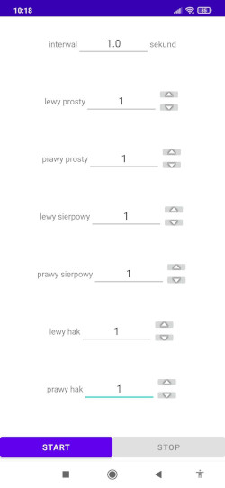

# Moje projekty
Hi, my name is Jędrzej Chmiel, and this is a list of some of my projects. Below each project's slow description you can find following things:
* link to the detailed description of the project (Usually it is a link to a githab repository to a README.md file, in which there is project description.)
* link to a video with an overview of the project (if such a video exists)
* link to repository
* one screenshot

I am a student of Computer Science (second year) at the Warsaw University of Technology at WEiTI (Faculty of Electronics and Information Technology). I am looking for an apprenticeship or internship for vacation (2023). Here is [link to my CV](https://drive.google.com/file/d/1WSfwEiToRkPZTQwJ-hS2UgAob4_LrOTU/view?usp=share_link), it contains a description of my skills and contact details. If you want to contact me, the best way is to write me a message on [LinkedIn (link)](https://www.linkedin.com/in/j%C4%99drzej-chmiel-481a8423b/).

## Projects:
1. [android app](#dukes-excercise-kotlin-android-studio) that allows users to train dodges
2. [Routing Information Protocol simulation](#routing-information-protocol-rip-simulation-c)
3. attempt to create (and train) [a neural network that will be able to write new chapter of Harry Potter](#harry-potter-chapter-writter-python-pytorch-jupyternotebook-numpy)
5. [online shop](#malwa-tea-php-javascript-sql-html-css) of fictionus company called "Malwa Tea" (a website)
6. [desktop application](#league-viewer-java-swing-maven-sql) that allows users to browse information about football leagues (matches, teams, football players) and to add new data.
7. [implementation of artificial neural network](#nerual-network-python-numpy) (with training, testing, regularisation, saving and loadning implementation) 
7. full implementation of [of generic Singly Linked List](#singly-linked-list-c)
8. implementation of AdaBoost algorithm ["AdaBoost"](#ada-boost-python-numpy-pandas)
9. [Generating Sequences of Rat Poses](#generating-sequences-of-rat-poses)

 

---

 

## Dukes Excercise (Kotlin, Android Studio)
The "Dukes Exercise" application was written by me using Android Studio completely in Kotlin. It is available on the [Play Store (link)](https://play.google.com/store/apps/details?id=zahenta.dukesexercise). The application can be used to train dodges before punches.
* [detailed description of the project](https://github.com/12jerek34jeremi/DukesExcercise/blob/main/README.md)
* [link to a video](https://drive.google.com/file/d/14v1DTA3-rx1C68ehiJzEjY5w-fsN8ktP/view?usp=share_link) in which project is presented. ***Video is in polish***, because app's user interface is also in polish.
* [repository](https://github.com/12jerek34jeremi/DukesExcercise)

---
  
## Routing Information Protocol (RIP) simulation (C++)
The map-rip project is a simulation of the first version of the RIP (Routing Information Protocol). The RIP protocol is, or rather was, used by routers in computer networks to find the best route to other routers. Each router in a network is identified by an IP address. However, to make the project more readable, I replaced IP addresses with city names. Apart from that, the protocol works exactly like RIP 1.
* [detailed description of the project](https://github.com/12jerek34jeremi/map_rip_protocol/blob/main/README.md)
* [link to a video](https://drive.google.com/file/d/1NYirSYcOkGkS0SOM7VKnOhkDMNWIPKke/view?usp=share_link) in which project is presented.
* [repository](https://github.com/12jerek34jeremi/map_rip_protocol)

---
  
## Harry Potter Chapter Writter (Python, Pytorch, JupyterNotebook, NumPy)
I tried to create (and train) a neural network that will be able to write a new chapter of Harry Potter.
* [detailed description of the project](https://github.com/12jerek34jeremi/harry_potter/blob/main/explanation.ipynb)
* [repository](https://github.com/12jerek34jeremi/harry_potter)

---
  
## Malwa Tea (PHP, javascript, SQL, HTML, CSS)
Malwa Tea is the project of a fictional company's online store website. Company is called "Malwa Tea". I hosted this website on Amazon AWS, and you can click on [this link](http://ec2-52-87-229-246.compute-1.amazonaws.com/) to see what the website looks like. 
* [detailed description of the project](https://github.com/12jerek34jeremi/shop2/blob/main/README.md)
* [link to a video](https://drive.google.com/file/d/1TIuaRz3wrAIUWZIIjwZIPpy4jEbDsXGx/view?usp=share_link) in which project is presented. ***Video is in polish***, because website is also in polish.
* [repository](https://github.com/12jerek34jeremi/shop2)

---
  
## League Viewer (java, Swing, Maven, SQL)
The League Viewer application was co-created by me as part of a project in Application Programming at the university. Application allows users to browse information about football leagues (matches, teams, football players) and to add new data.
* [detailed description of the project](https://github.com/12jerek34jeremi/league_viewer/blob/main/README.md)
* [link to a video](https://drive.google.com/file/d/1wyUm6_Vz_4pqdqQw1XxXmbbhKgX2G-dE/view?usp=share_link) in which project is presented. ***Video is in polish***, because app's user interface is also in polish.
* [repository](https://github.com/12jerek34jeremi/league_viewer)

---
  
## Nerual Network (Python, NumPy)
Project Neural Network is an implementation of artificial neural network. You can train and train a network as well as save and load a network from a file. Dropdown and L1/L2 regularizations are also implemented.
* [detailed description of the project](https://github.com/12jerek34jeremi/Neural-Network/blob/master/notebook.ipynb)
* [repository](https://github.com/12jerek34jeremi/Neural-Network)

---
  
## Singly Linked List (C++)
Pełna implementacja uogólnionej listy jednokierunkowej. Pozwala na swtorzenie listy o dowolnym typie klucz i dowolnej typie wartości.
Full implementation of Singly Linked List. IT allows yo crate a list of any type of key and any type of value.
* [detailed description of the project](https://github.com/12jerek34jeremi/SLL/blob/main/README.md)
* [repository](https://github.com/12jerek34jeremi/SLL)

---
  
## Ada Boost (Python, NumPy, Pandas)
The AdaBoost project is my original implementation of the Machine Learning algorithm called "AdaBoost" . I used this implementation in the [Kaggle contest (link)](https://www.kaggle.com/competitions/knsi-golem-bootcamp2021-competition/leaderboard) in which I took 6th place. I didn't use any Machine Learning libraries (like scikit-learn or pytorch), it's written using only NumPy and Pandas.

* [repository](https://github.com/12jerek34jeremi/AdaBoost)

---
  
## Generating Sequences of Rat Poses
A took part in event called BrainHack Warsaw 2022 ([link](https://brainhackwarsaw.github.io/)), in which we tested hidden space of Normalising Flow algorythm. This algorithm uses reversivle fuctions to transform some given distribution into a normal distribution. At the end of BrainHack we presented our project to other teams. [link to the presentation](https://docs.google.com/presentation/d/1G820T4yWyVaXoxoKl5m7DvrIJ4RtSjMvb2mgWAeKOYU/edit?usp=sharing) 

